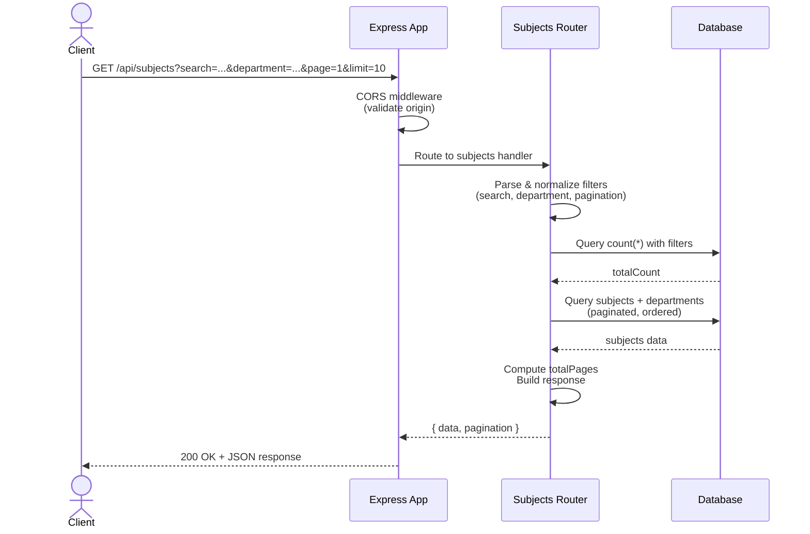

# Admin-Dashboard-Backend

## Release Notes 0.3
### New Features
- Database foundation established with schema for user account management, authentication sessions, class information storage, and enrollment tracking.
- User role-based access control system implemented with support for different user types and permission levels.
- Verification and data integrity mechanisms integrated throughout the system.

## Release Notes 0.2.1
### New Features

- New subjects endpoint with search, department filtering, and pagination capabilities
- CORS support enabled for cross-origin requests
- Documentation

## Release Notes 0.1.1
### New Features
- Integrated PostgreSQL database infrastructure to support departments and subjects management
- Added automated database migration workflow with version control for schema changes
- Implemented database connectivity layer with ORM support for streamlined data operations
- Established department-subject relationships with referential integrity constraints
---
## License

MIT