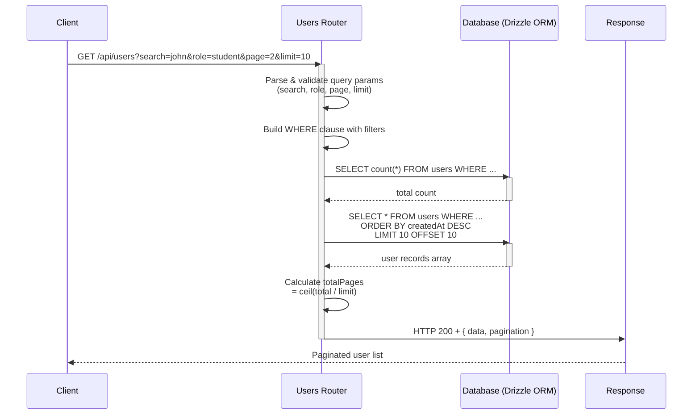

# Admin-Dashboard-Backend
Backend for a university admin dashboard built with Node.js, Express, and PostgreSQL. Handles authentication, role-based access control, rate limiting, bot protection, and REST API endpoints for managing departments, subjects, classes, and enrollments.

## Tech Stack

| Layer | Technology |
|---|---|
| Runtime | Node.js |
| Framework | Express.js |
| Language | TypeScript |
| Database | PostgreSQL via NeonDB (serverless) |
| ORM | Drizzle ORM |
| Auth | Better-Auth |
| Security | Arcjet (rate limiting, bot protection, shield) |
| Image Storage | Cloudinary |
| Monitoring | Site24x7 |

## Architecture



## Database Schema

Six tables with relational integrity:

```
user ──< session
user ──< account
user ──< enrollments >── classes ──> subjects ──> departments
classes ──> user (teacher)
```

| Table | Description |
|---|---|
| `user` | Auth users with roles: student, teacher, admin |
| `session` | Active sessions managed by Better-Auth |
| `account` | OAuth provider accounts |
| `verification` | Email verification tokens |
| `departments` | University departments |
| `subjects` | Subjects belonging to departments |
| `classes` | Classes linked to subject + teacher, with banner image |
| `enrollments` | Student ↔ class join table (composite PK) |

## Security — Arcjet

Role-based rate limiting via sliding window (per minute):

| Role | Limit |
|---|---|
| Guest | 5 requests/min |
| Student / Teacher | 10 requests/min |
| Admin | 20 requests/min |

Additionally blocks: automated bots, requests flagged by Arcjet Shield policy.

## API Endpoints

### Subjects
```
GET /api/subjects
```
Query params:
| Param | Description |
|---|---|
| `search` | Case-insensitive search by name or code |
| `department` | Filter by department name |
| `page` | Page number (default: 1) |
| `limit` | Results per page (default: 10, max: 100) |

Response shape:
```json
{
  "data": [...],
  "pagination": {
    "page": 1,
    "limit": 10,
    "total": 42,
    "totalPages": 5
  }
}
```

## Getting Started

### Prerequisites
- Node.js 20+
- PostgreSQL database (NeonDB recommended)
- Arcjet account
- Cloudinary account
- Site24x7 account (optional, for monitoring)

### Installation

```bash
git clone https://github.com/maherhms/Admin-Dashboard-Backend
cd Admin-Dashboard-Backend
npm install
```

### Environment Variables

Create a `.env` file:

```env
DATABASE_URL=
BETTER_AUTH_SECRET=
BETTER_AUTH_URL=
ARCJET_KEY=
CLOUDINARY_CLOUD_NAME=
CLOUDINARY_API_KEY=
CLOUDINARY_API_SECRET=
FRONTEND_URL=http://localhost:5173
NODE_ENV=development
```

### Database Setup

```bash
# or generate and run migrations
npm run db:generate
npm run db:migrate
```

### Run

```bash
# development
npm run dev

# production
npm run build
npm start
```

## Frontend

→ [Admin-Dashboard-Frontend](https://github.com/maherhms/Admin-Dashboard-Frontend)

## Release Notes 0.4
### New Features
- Added API endpoint to create class records with auto-generated invite codes.
- Added API endpoint to retrieve users with search, role filtering, and pagination capabilities.

## Release Notes 0.4
### New Features
- User authentication system with email and password login.
- Role-based user access control.
- Security protections including rate limiting and bot detection.

## Release Notes 0.3
### New Features
- Database foundation established with schema for user account management, authentication sessions, class information storage, and enrollment tracking.
- User role-based access control system implemented with support for different user types and permission levels.
- Verification and data integrity mechanisms integrated throughout the system.

## Release Notes 0.2.1
### New Features

- New subjects endpoint with search, department filtering, and pagination capabilities
- CORS support enabled for cross-origin requests
- Documentation

## Release Notes 0.1.1
### New Features
- Integrated PostgreSQL database infrastructure to support departments and subjects management
- Added automated database migration workflow with version control for schema changes
- Implemented database connectivity layer with ORM support for streamlined data operations
- Established department-subject relationships with referential integrity constraints
---
## License

MIT